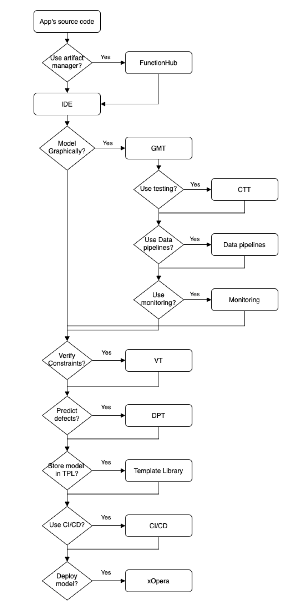

# RADON Demonstrator (training)

## Overview

This repository contains workshop labs and best
practices for tools in the RADON framework
toolstack.
It is recommended for new users of the RADON framework to follow the **labs 1-4 as a basic training**. For more advanced usage follow the labs 5-13 according to interest.

## Prerequisites

In order to conduct these labs, you need the
following prerequisites:

- An AWS account to deploy the application to.
- A user on the
  [Eclipse Che environment](http://che-che.51.11.43.6.nip.io/).

## Training labs

1. [Introduction to the application and RADON](labs/introduction.md)
2. [Working with the IDE](labs/ide.md)
3. [Moving source code to FunctionHub](labs/functionhub.md)
4. [Modeling the application with GMT](labs/gmt.md)
5. [Deploying the csar with xOpera](labs/xopera.md)
6. [Testing your Application with the Continuous Testing Tool (CTT)](labs/ctt.md)
7. [Detecting code defects with Defuse](labs/dpt.md)
8. [Adding Data pipelines](labs/datapipelines.md)
9. [Adding verification constraints with VT](labs/vt.md)
10. [Finding optimal deployment with the Decomposition Tool (DT)](labs/dt.md)
11. [Adding monitoring with Prometheus & Grafana](labs/monitoring.md)
12. [Storing deployment templates in Template Library](labs/templatelibrary.md)
13. [Enabling CI/CD](labs/cicd.md)

## RADON workflow




## Directory

```
.
├── labs        # All lab descriptions
├── README.md   # What you are reading now
└── todos       # The application we want to deploy
```
