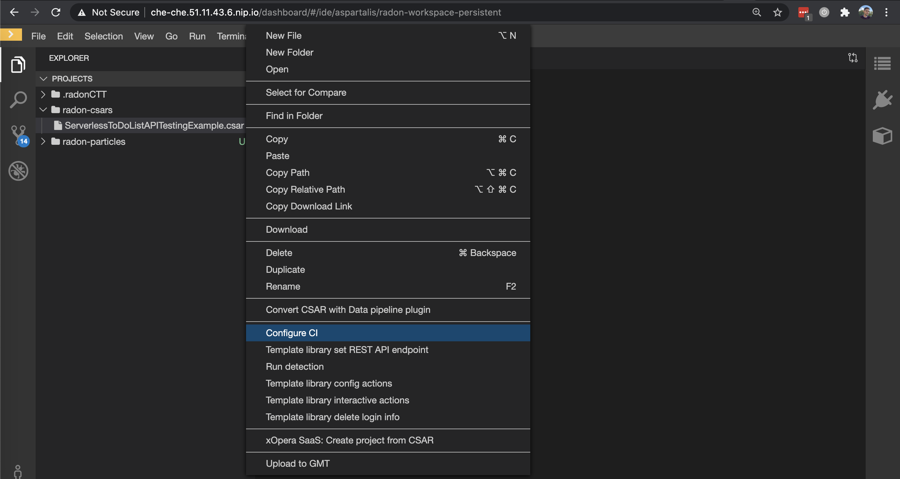
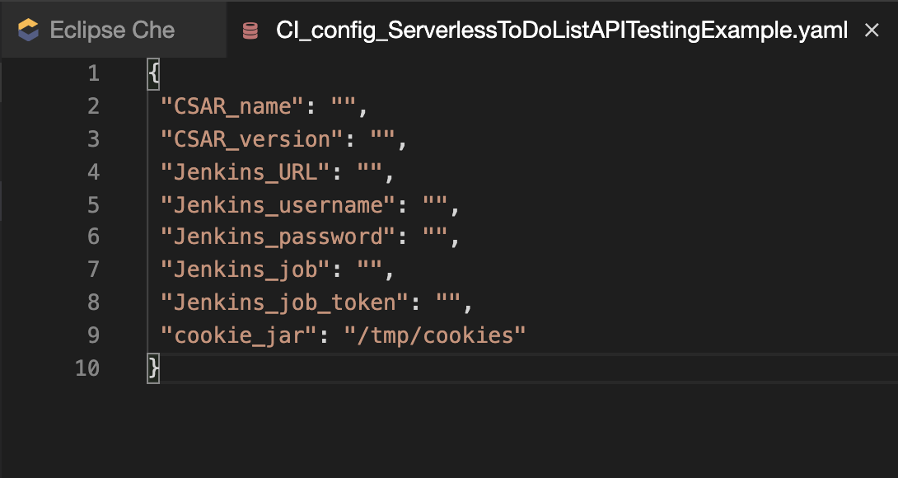
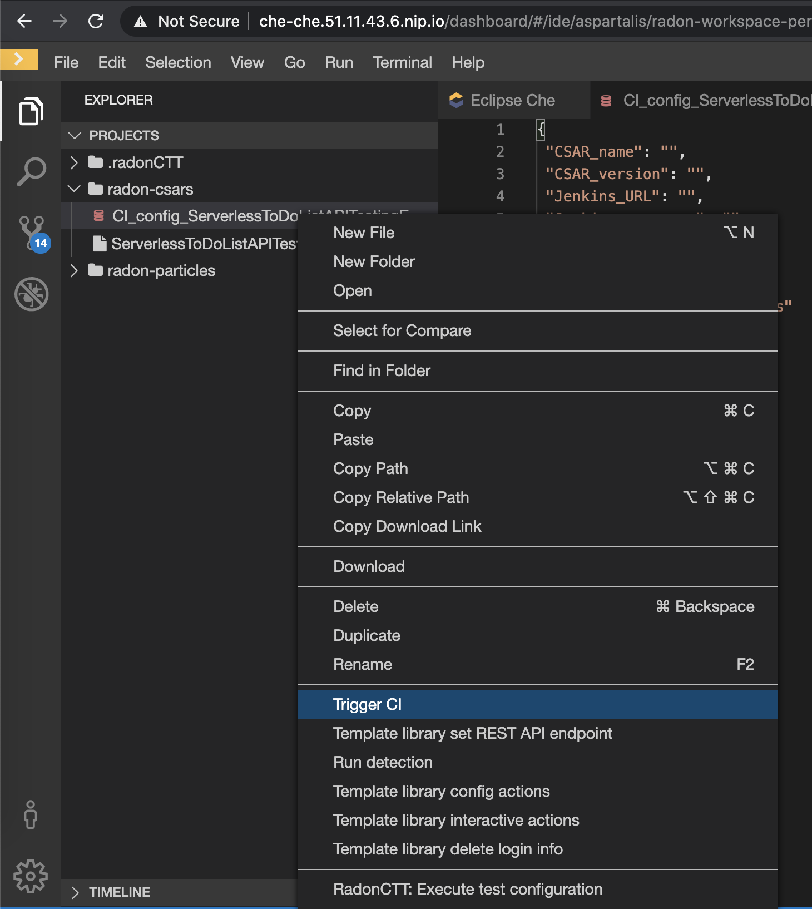
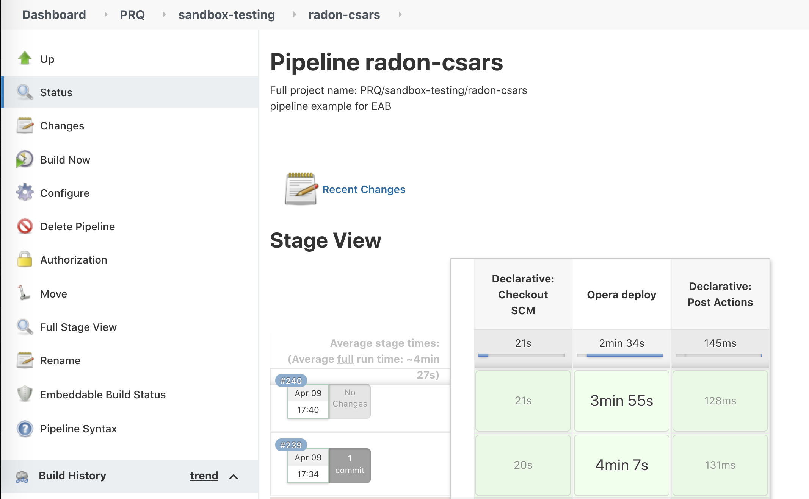

# CI/CD
Continuous integration and deployment can be integrated in any project developed in RADON as most RADON tools support command-line execution.

##  Prerequisites
In order to use the CI/CD plugin through the RADON IDE you will need:
- Access to Jenkins server with adequate permissions to create and build a project.
- A pre-made Jenkins project configured to execute the pipeline of your choice. Pipeline templates can be found [here](https://github.com/radon-h2020/radon-cicd-templates).
-   Set up of AWS credentials as secret environment variables in the Jenkins server.
- A csar deployment file (you can export it straight from the GMT).
 
## The IDE plugin
CI/CD builds in Jenkins can be triggered manually by the user using the CI/CD plugin straight from the IDE. 
### Tasks
- Right click on csar file and choose the option `Configure CI` as shown in the following picture.


A new yaml file will be generated named after your csar file with the prefix **CI_config_**. The configuration file requires a set of information in order to source the project and build it.


- Fill up the CI_config yaml file info as following:
	<details>
      <summary>CI_config</summary>

    ```
    {
    "CSAR_name": "YOUR_CSAR_NAME",
    "CSAR_version": "YOUR_CSAR_VERSION",
    "Jenkins_URL": "YOUR_JENKINS_URL",
    "Jenkins_username": "YOUR_JENKINS_USERNAME",
    "Jenkins_password": "YOUR_JENKINS_PASSWORD",
    "Jenkins_job": "YOUR_JENKINS_JOB_NAME",
    "Jenkins_job_token": "YOUR_JENKINS_JOB_TOKEN",
    "cookie_jar": "/tmp/cookies"
    }
    ```
 - Right click on your CI_config file and choose the option `Trigger CI` as shown in the following picture.
 
 
 
 
## Outcome
After triggering the pipeline from the IDE, the job is being built in the Jenkins environment providing execution logs to the user.


