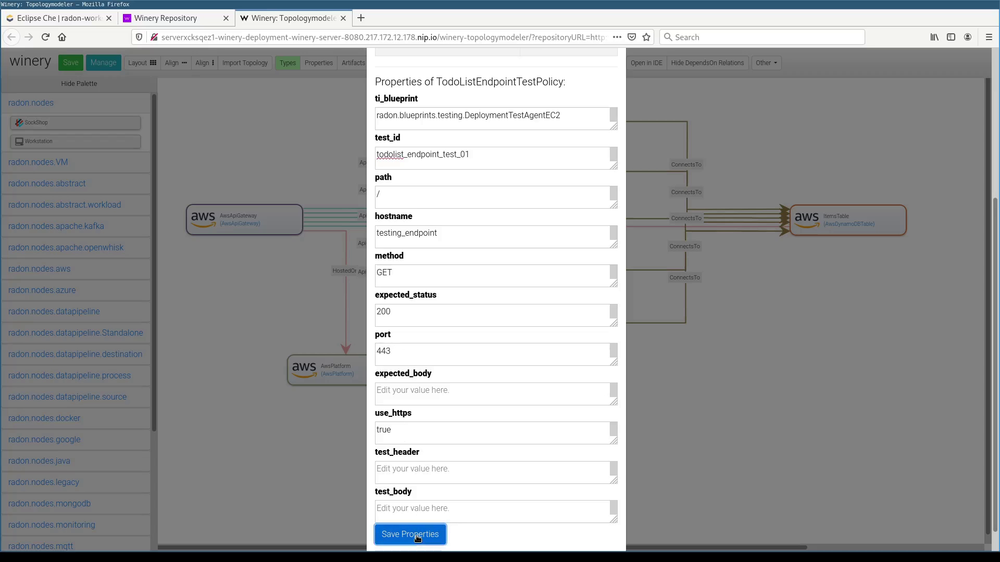
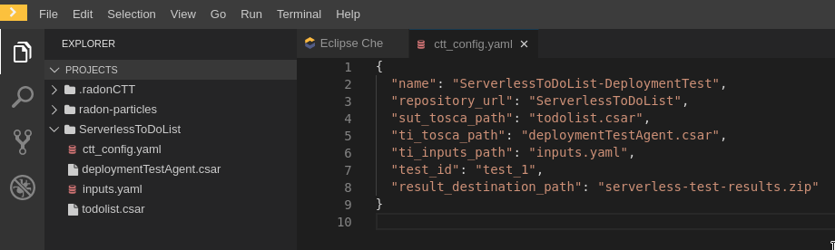
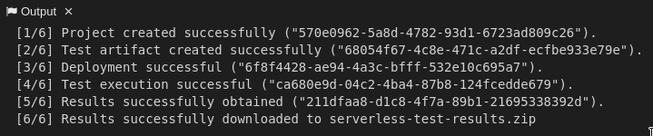

## Testing your Application with the Continuous Testing Tool (CTT)

The Continuous Testing Tool (CTT) provides the means to deploy the
application that is supposed to be tested, the so-called system under
test (SUT), and a testing agent, the so-called test infrastructure (TI),
that executes the defined tests against the SUT. After the deployment
has succeeded, the defined test is executed and the results are
obtained. Tests and test-related information are defined in the TOSCA
models of the SUT and TI. The complete functionality of the tool is
described in the CTT documentation[^1].

In this usage description, we go through the test of the
"ServerlessToDoListAPI" and an endpoint test that makes sure that the
deployment was successful. The SUT is a FaaS-based implementation of a
ToDo-list using AWS services, especially AWS-Lambda functions. The TI
consists of a Docker container of a test agent for CTT that is deployed
on top of a AWS EC2 instance.

To make this example work, some information is needed beforehand: AWS
Access Key ID, AWS Secret Access Key, AWS EC2 SSH Key Type (e.g.,
OPENSSH, RSA), AWS EC2 SSH Key (without the header and footer sections),
AWS EC2 SSH Key Name, AWS VPC Subnet ID.

The concrete steps are as follows:

### Preparing the Workspace with Credentials

 In order to use CTT in the context of the RADON IDE, some credentials
 need to be provided when the workspace is created. The said
 credentials are required in order to deploy the SUT and the TI on the
 respective service providers' infrastructures (e.g., AWS).

 These credentials need to be filled in into the workspace
 configuration devfile.yaml before the workspace is created. Listing 1
 shows an exemplary excerpt of the devfile.yaml's CTT env-section on
 how the fields need to be populated with the credentials.

     env:
      - name: OPERA_SSH_USER
        value: "ubuntu"
      - name: OPERA_SSH_IDENTITY_FILE
        value: \"/tmp/aws-ec2\"
      - name: AWS_ACCESS_KEY_ID
        value: \"AKSDF4353SFD3NMGXHERWQ\"
      - name: AWS_SECRET_ACCESS_KEY
        value: "6QYMAS4sdfhAHDJ1L+pfgqZt/9OcxUN8a1/vg/ly"
      - name: SSH_KEY_TYPE
        value: "OPENSSH"
      - name: SSH_PRIV_KEY
        value: >
          c3BlbnNzaC1rZXktdjEAAAAABG5vbmUAAAA
          NhAAAAAwEAAQAAAxUA9DcKpAwyCTystithD
          [..]
          Akawm0cQ55NZ76el6jzUWBDePeT7mmWUCfm
          kVpfAebH2+m6/F/KpFE2Q8aFBhWSVD3SmX5
          YPAAAAAAECCwQ=
> **Listing 1**: Exemplary devfile.yaml environment-section for CTT credentials

Once these variables are set, the workspace can be created.

### 1. Attaching a Test Policy to the "Serverless ToDoList"

 In order to assign the required information for testing an application
 (named "system under test" or abbreviated as "SUT" ) with CTT, first a
 model in GMT needs to be created. Within the model of the SUT,
 so-called policies add the information about the tests that CTT will
 later execute.

 In GMT, open your SUT in the topology modeler. On the top menu, click
 on the 'Manage Policies' button. In the now opened dialogue, click on
 the blue button labeled 'Add'. Then, enter a name for the policy you
 are about to create. For example, "ToDoListEndpointTestPolicy" and
 choose the matching policy type for the test, which is
 `{radon.policies.testing}HttpEndpointTest` in this case. Once you
 click on "Add", the new policy is created and is shown in the lower
 part of the dialog. To provide test-specific details, select the newly
 created policy, which extends the dialog with the available
 properties, as seen in Figure 1.

 
 **Figure 1**: Screenshot of Test Policy Property Dialog

 In the following, only the fields required for the current scenario
 will be covered.

 The property ti_blueprint defines the blueprint of the test
 infrastructure the test is supposed to be executed with. The test_id
 is a unique identifier for the test that can be defined individually.

 The following properties, comprising path, hostname, method,
 expected_status, port, and use_https represent the HTTP parameters for
 a request to the target system. The property hostname can either be
 filled with a fixed hostname (e.g., google.com) or can take the name
 of a TOSCA output of the SUT (e.g., the dynamically created hostname
 of a system deployed on an AWS EC2 instance).

 The remaining fields are not mandatory in the current example and can
 be left empty.

 Once the properties of the testing policy have been entered and saved,
 the testing policy needs to be assigned to a component in the model.

 In order to do so, click on the "Policies" button on the top menu and
 extend the policies for the component of your choice. The previously
 created policy is listed there and can be activated by checking the
 checkbox under the "Is Activated?" label as depicted in Figure 2.

 
 **Figure 2**: Screenshot of Test Policy Activation

### Configuring the Test Scenario

 Once the workspace is started and completely loaded, we create a new
 directory that holds all files that are needed to execute CTT. In this
 example, we name it "ServerlessToDoList". The CSAR files of the
 Serverless ToDo-List API service template and the CTT DeploymentTest
 agent are put into this directory, as well as an inputs.yaml file that
 provides some inputs needed for the deployment of the TI. The fields
 to fill are highlighted in bold in Listing 2.

        ---
        vpc_subnet_id: "subnet-04706a8b41abdefa5"
        ssh_key_name: "awsec2"
        ssh_key_file: "/tmp/aws-ec2"
        ...                                                                  |

> **Listing 2**: Exemplary inputs.yaml file

 The configuration of the CTT execution itself is specified by a YAML
 configuration file. In this file, the following properties need to be
 defined:

-   Name for the test configuration
-   Folder, the artifacts are placed in
-   SUT CSAR path (relative to the folder)
-   SUT inputs file (optional, relative to the folder)
-   TI CSAR path (relative to the folder)
-   TI inputs file (optional, relative to the folder)
-   Test Id of the test to be executed (not yet taken into account)
-   Results output file path (relative to configuration file)

In Listing 3, you can find an exemplary CTT configuration file named ctt_config.yaml

        {
            "name": "ServerlessToDoList-DeploymentTest",
            "repository_url": "ServerlessToDoList",
            "sut_tosca_path": "todolist.csar",
            "ti_tosca_path": "deploymentTestAgent.csar",
            "ti_inputs_path": "inputs.yaml",
            "test_id": "test_1",
            "result_destination_path": "serverless-test-results.zip"
        }

> **Listing 3**: Exemplary ctt_config.yaml file

 Please note that the folder property is currently named repository_url
 for historical reasons. In the future, this property will be renamed.

Figure 19: ServerlessToDoListAPI scenario in the RADON IDE

### Executing CTT (using the RADON IDE)

 After all preparations are finished, you can right-click on the
 ctt_config.yaml file and choose the option RadonCTT: Execute test
 configuration.

 

 Figure 20: Progress log in the output panel

 The progress can be seen in the output panel (see Figure 20) and a
 progress bar appears on the lower right. Depending on the underlying
 infrastructure, this process can take some time until the process is
 finished. Once the process is finished, you find the results in a
 ZIP-file located where you specified the result_destination_path.

### Executing CTT (using the CTT CLI Tool)

 In addition to the possibility to execute CTT from within the RADON
 IDE, we also provide a command-line tool called the "CTT CLI Tool"
 which allows the execution of CTT from the command line. The CLI Tool
 can be used as part of continuous integration or in any other kind of
 automated process.

 Similarly to the execution using the RADON IDE, the CTT CLI Tool,
 which is written in Python, uses the same configuration file format
 (see Listing 3) to define the parameters for a
 test execution.

 Listing 4 shows the usage of the CTT CLI Tool
 and the respective invocation for the example configuration file. The
 two mandatory parameters are the URL of the CTT server as well as the
 configuration file that should be used for the execution.

        % ./ctt_cli.py --help
        ctt-cli.py [PARAMS]

        Mandatory parameters:
        -u, --url=CTT_SERVER_URL URL of the CTT server
        -c, --config=CTT_CONFIG Path to the CTT configuration file

        Other parameters:
        -v, --verbose Be verbose
        -h, --help Print this help

        % ./ctt_cli.py -u "http://localhost:18080/RadonCTT" -c ctt_config.yaml                                                    

> Listing 4: Usage and invocation of the CTT CLI Tool
