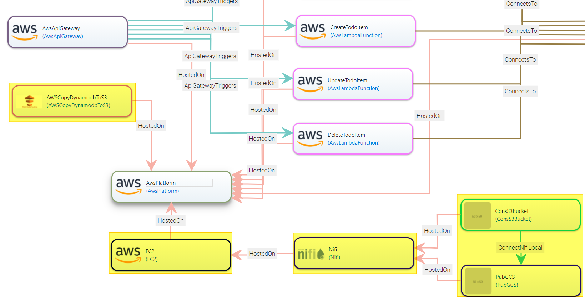
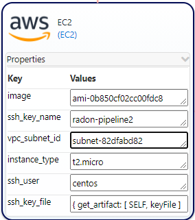
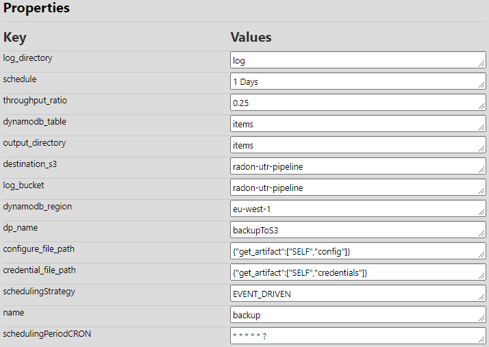
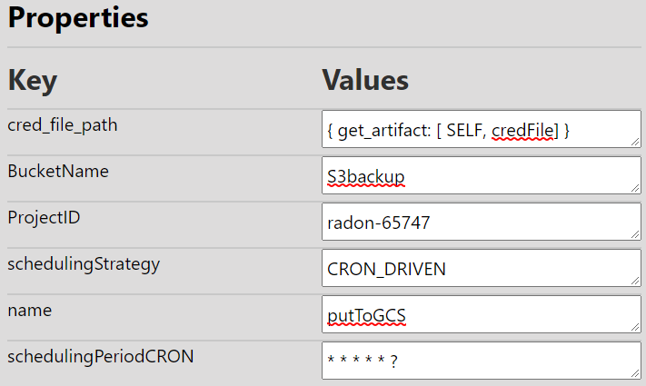
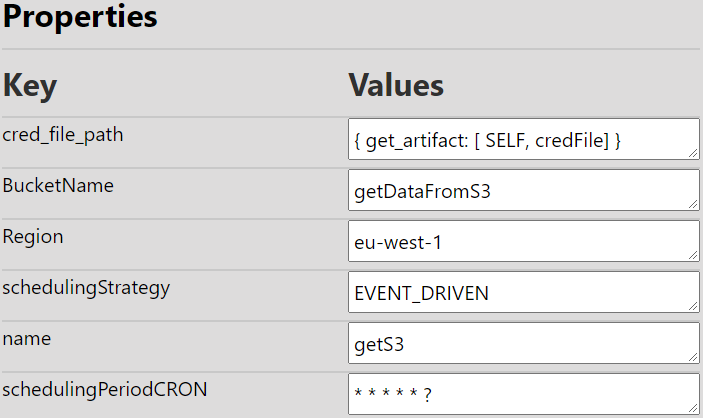
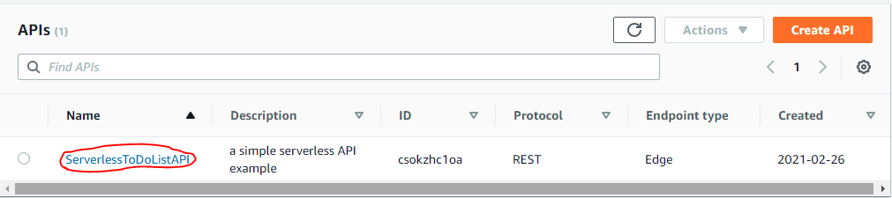
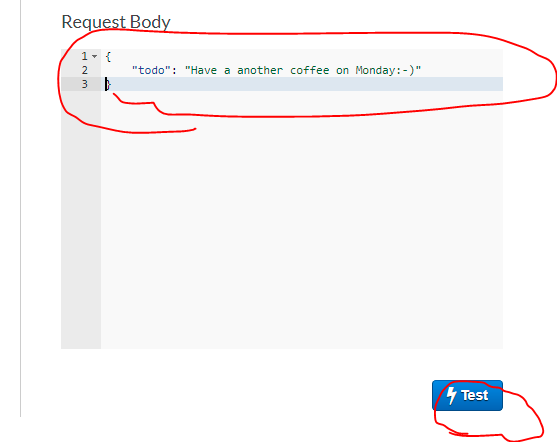
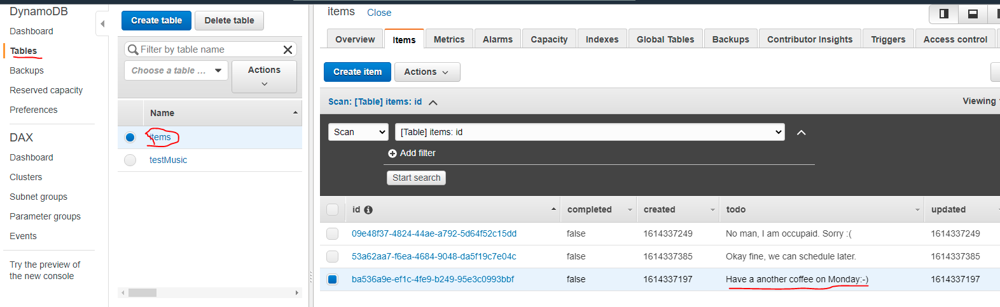

# Data Pipeline tool

Data pipeline focuses on flow of data across multiple private and public clouds. Serverless platform is integrated allowing the developers to process the data on the fly. In addition a number of features such as encrypting the data, support for logging are provided by the data pipeline TOSCA models. The developed TOSCA models can be found in the official [radon-particle GitHub repo](https://github.com/radon-h2020/radon-particles).

The detailed description of RADON data pipeline can be found in [RTD page](https://datapipeline-plugin.readthedocs.io/en/latest/).

The given [“ServerlessToDoListAPI”](https://github.com/radon-h2020/RADON-workshop/blob/main/labs/introduction.md) example can be further improved with additional features such as taking backup of the AWS DynamoDB data into S3 bucket and Google Cloud Storage. In precise, we will add the following capabilities to the example for backup purpose.
* Copy the data from AWS DynamoDB to AWS S3 bucket. 
* Copy the data in AWS S3 Bucket to Google Cloud Storage(GCS) bucket for backup purpose. 
This would demonstrate the advantage of the data pipeline in smooth data flow from one cloud platform to another addressing the vendor lock-in issue. For this, the “ServerlessToDoListAPI” service blueprint is modified by adding a number of pipeline nodes highlighted in the figure below.


## Pipeline Platform 
For the implementation of pipeline related nodes, we need mainly two pipeline platforms: AWS data pipeline (as commercial data management solution) and Apache Nifi (open-source data management solution).

### AWS data pipeline platform
To setup AWS data pipeline platform, no specific node type is needed and all the AWS data pipeline related TOSCA nodes (in this example it is AWSCopyDynamodbToS3) will be hosted on AWSPlatform TOSCA node, as shown in above figure.
### Nifi-based platform
To setup Apache Nifi platform, an EC2 instance is needed along with the Nifi TOSCA node. The EC2 instance can be created using EC2 TOSCA node type. The required properties of the EC2 node are given in the below figure. Below figure can be used as reference. We recommend using centos image over Ubuntu image. For Apache Nifi, the user needs to provide the required version, which is a mandatory property.


## Data Flow from AWS DynamoDB to S3 bucket
For this, the “ServerlessToDoListAPI” service blueprint is modified by adding an “AWSCopyDynamodbToS3” node with the following properties.


_AWSCopyDynamodbToS3_ TOSCA data pipeline node requires _AWSPLatform_ node as the host. List of properties and possible values are shown in above figure. The config and the credential files can be passed through the artifacts. Below are the content of config and credential files.

<details>
      <summary>config.txt</summary>

Content of the _config.txt_

```
[default]
region = eu-west-1
```
</details>

<details>
      <summary>credentials.txt</summary>

Content of _credentials.txt_
```
[default]
aws_access_key_id = <secret>
aws_secret_access_key = <secret>
```

</details>

## Data flow from AWS S3 to Google cloud storage bucket

Now to move the data from AWS S3 to Google cloud storage bucket, we need to use _PubsGCS_ and _ConsS3Bucket_ nifi-based node types. All NiFi-base data pipeline node types require a _NiFi_ node as the host. Further, _NiFi_ TOSCA node requires a container type TOSCA node as a hosting environment. In this example, we will use _EC2_ as the hosting environment for _NiFi_, as shown in the first figure.


The above figure shows the list of properties and possible values for _PubGCS_ TOSCA node. One possible way to provide the credential files is through the artifacts. Make sure that the credential file is in the JSON format which can be downloaded from the Google console. The Scheduling strategy can be left as default. _BucketName_ is the name of the storage bucket, which you may get from https://console.cloud.google.com/storage/. You may also get your project id from here https://console.cloud.google.com/home/dashboard . 

The below figure shows all the possible properties’ values for the _ConsS3Bucket_ TOSCA node. Make sure that the S3 bucket is already created.


Thats all. Now save the service template in CSAR format, export to IDE and go ahead with the deployment.  You may find the deatiled informaiton on how to deploy your CSAR in [Lab 5](https://github.com/radon-h2020/RADON-workshop/blob/main/labs/xopera.md)

## Verify the deployment.
* Login to the AWs console and see the list of apis: https://eu-west-1.console.aws.amazon.com/apigateway/main/apis
* Here you should see newly created api: 

* Click on Api name.
* Now click on `POST` -> `TEST`.
* In Request body, put the following content and hit `Test` button.
```
            {
            "todo": "Have a another coffee on Monday:-)"
            }
```

* Now check the dynamodb tabel: https://eu-west-1.console.aws.amazon.com/dynamodb/home?region=eu-west-1#tables:
* Click on the `items` table. You should be able to see the new item.


* You can also see the list of functions created and deployed thtough this link; https://eu-west-1.console.aws.amazon.com/lambda/home?region=eu-west-1#/functions


The detailed description of RADON data pipeline can be found in [RTD page](https://datapipeline-plugin.readthedocs.io/en/latest/).


