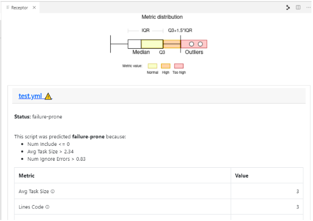

# Defuse: the IaC Defect Prediction Tool within RADON

Defuse analyzes the characteristics of IaC blueprints to predict their defect-proneness.
Its models can be used within the RADON IDE, via a dedicated plugin, or in Continuous Integration pipelines.
The tool's output consists of TOSCA and Ansible files metrics along with hints on the blueprints to investigate.

The figure above shows the contextual menu to run the defect prediction tool.
The models can be invoked within the plugin by performing "Run detection" on the csar final of the final application to be deployed.

The figure above shows the panel of the defect prediction plugin integrated into the RADON IDE.
A new tab opens in the IDE workspace, showing a list with all the files suitable for the analysis.
For each file, the plugin provides a set of metrics by clicking on them, highlighting whether each particular file is defective or not, and providing an interpretation of the prediction.
