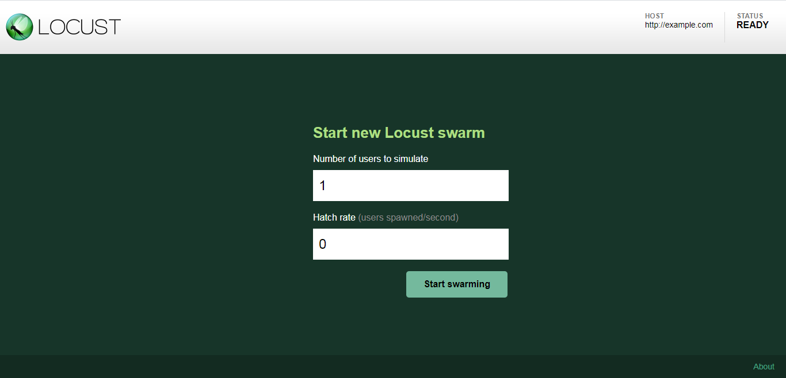
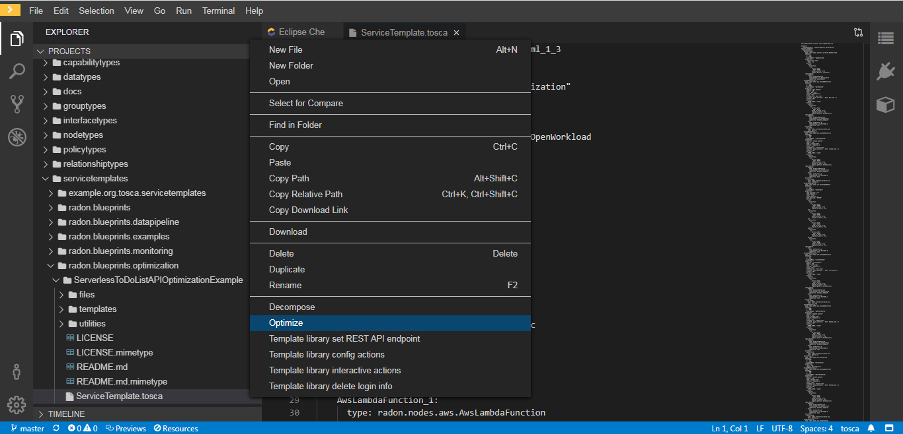

## Finding optimal deployment with the Decomposition Tool (DT)

The decomposition tool aims to help in finding the optimal decomposition
solution for an application based on the microservices architectural style and
the serverless FaaS paradigm. It supports three typical usage scenarios: (i)
architecture decomposition, (ii) deployment optimization, (iii) accuracy
enhancement.

In what follows, we show how to use the decomposition tool to obtain the optimal
deployment scheme of the ServerlessToDoListAPI application, minimizing its total
operating cost on the AWS platform under the specified performance requirement.
The ServerlessToDoListAPI application can be considered as exposing five RESTful
endpoints, namely *list*, *get*, *create*, *update* and *delete*. For brevity,
we only take the *list* endpoint for example to clarify the steps toward
deployment optimization. The TOSCA model including a full version of the service
template, function packages and Python utilities present below can be found
[here in RADON
Particles](https://github.com/radon-h2020/radon-particles/tree/master/servicetemplates/radon.blueprints.optimization/ServerlessToDoListAPIOptimizationExample).

### 1. Performance Modeling

The development of the decomposition tool is based on layered queueing networks
(LQNs), a performance modeling formalism applicable to most modern distributed
systems. A dedicated set of data types and an abstract layer of node and
relationship types are defined in RADON Particles, allowing the use of LQN
annotations to describe the behavior of an application. We also define practical
policy types for specifying performance requirements. D3.2 Decomposition Tool I
and D3.3 Decomposition Tool II present an introduction to LQNs and details about
the definitions of TOSCA types specific to the decomposition tool.

Suppose that the ServerlessToDoListAPI application receives an infinite stream
of requests arriving on average every 0.2 seconds and each request may be
destined for the *list* endpoint with a probability of 0.2. Such a reference
workload can be modeled using the *OpenWorkload_0* node defined in Listing 1.
This node has one entry named *start*, which contains a single activity that
sends requests in a stochastic pattern. The *ClosedWorkload_0* node connects to
the *AwsApiGateway_0* node through the *con_ConnectsTo_5* relationship. Listing
2 shows the definition of the *con_ConnectsTo_5* relationship, where a
synchronous interaction from the *start.a1* activity of the *ClosedWorkload_0*
node to the *list* entry of the *AwsApiGateway_0* node is specified. The latter
represents the *list* endpoint.

        ClosedWorkload_0:
          type: radon.nodes.abstract.workload.ClosedWorkload
          properties:
           interarrival_time:
              mean: 0.2
            entries:
              start:
                 a1:
                    service_time:
                      mean: 0.001
                    bound_to_entry: true
                    request_pattern: stochastic
          requirements:
            - endpoint:
                node: AwsApiGateway_0
                relationship: con_ConnectsTo_5
                capability: api_endpoint
> **Listing 1**: Definition of the *ClosedWorkload_0* node

        con_ConnectsTo_5:
          type: radon.relationships.ConnectsTo
          properties:
            interactions:
              - type: synchronous
                source_activity: start.a1
                target_entry: list
                number_of_requests: 0.2
> **Listing 2**: Definition of the *con_ConnectsTo_5* relationship

Upon receipt of a *list* request, the *AwsApiGateway_0* node triggers the
*AwsLambdaFunction_0* node through the *con_AwsApiGatewayTriggers_0*
relationship. Listings 2 and 3 show the definitions of the *AwsApiGateway_0*
node and the *con_AwsApiGatewayTriggers_0* relationship. The *list* entry of the
*AwsApiGateway_0* node has a single activity that sends requests in a
deterministic pattern and replies with responses upon completion as *list*
requests are synchronous. The interaction between the *list.a1* activity of the
*AwsApiGateway_0* node and the entry of the *AwsLambdaFunction_0* node is
defined by the *con_AwsApiGatewayTriggers_0* relationship.

        AwsApiGateway_0:
          type: radon.nodes.aws.AwsApiGateway
          properties:
            entries:
              list:
                activities:
                  a1:
                    service_time:
                      mean: 0.125
                    bound_to_entry: true
                    replies_to_entry: true
                    request_pattern: deterministic
          requirements:
            - invoker:
                node: AwsLambdaFunction_0
                relationship: con_AwsApiGatewayTriggers_0
                capability: invocable
> **Listing 3**: Definition of the *AwsApiGateway_0* node

        con_AwsApiGatewayTriggers_0:
          type: radon.relationships.aws.AwsApiGatewayTriggers
          properties:
            interactions:
              - type: synchronous
                source_activity: list.a1
                target_entry: execute
                number_of_requests: 1.0
> **Listing 4**: Definition of the *con_AwsApiGatewayTriggers_0* relationship

To capture the behavior of the *AwsLambdaFunction_0* node, we introduce an entry
named *execute*, as shown in Listing 5. This entry is defined similarly to the
*list* entry of the *AwsApiGateway_0* node, because the *AwsLambdaFunction_0*
node simply performs a *scan* operation on the *AwsDynamoDBTable_0* node and
returns the result to the *AwsApiGateway_0* node. Listing 6 shows the definition
of the *con_ConnectsTo_0* relationship, which connects the *AwsLambdaFunction_0*
node to the *AwsDynamoDBTable_0* node and defines the interaction between the
*execute.a1* activity of the former and the *scan* entry of the latter.

        AwsLambdaFunction_0:
          type: radon.nodes.aws.AwsLambdaFunction
          properties:
            entries:
              execute:
                activities:
                  a1:
                    service_time:
                      mean: 0.046
                    bound_to_entry: true
                    replies_to_entry: true
                    request_pattern: deterministic
          requirements:
            - endpoint:
                node: AwsDynamoDBTable_0
                relationship: con_ConnectsTo_0
                capability: database_endpoint
> **Listing 5**: Definition of the *AwsLambdaFunction_0* node

        con_ConnectsTo_0:
          type: radon.relationships.ConnectsTo
          properties:
            interactions:
              - type: synchronous
                source_activity: execute.a1
                target_entry: scan
                number_of_requests: 1.0
> **Listing 6**: Definition of the *con_ConnectsTo_0* relationship

The definition of the *AwsDynamoDBTable_0* node is shown in Listing 7. In the
*scan* entry of the *AwsDynamoDBTable_0* node, an activity with no request
pattern is defined due to the fact that it is the end of the request chain. Note
that the name of each entry in an *AwsDynamoDBTable* node must be prefixed with
the name of the operation that it is associated with, e.g. "get", "get_item" and
"getItem". This enables the decomposition tool to compute the operating cost of
the node. The supported operations for an *AwsDynamoDBTable* node include *get*,
*put*, *update*, *delete*, *query* and *scan*.

        AwsDynamoDBTable_0:
          type: radon.nodes.aws.AwsDynamoDBTable
          properties:
            entries:
              scan:
                activities:
                  a1:
                    service_time:
                      mean: 0.003
                    bound_to_entry: true
                    replies_to_entry: true
> **Listing 7**: Definition of the *AwsDynamoDBTable_0* node

### 2. Benchmarking

To parametrize the mean service times of activities, we need to create a
benchmark of the ServerlessToDoListAPI application. However, it is difficult to
apply commonly-used benchmarking methods to Lambda functions as quantities
required by these techniques are not measurable on AWS. Lambda allocates
dedicated memory and CPU resources to each instance of a function. The service
times of activities performed by Lambda functions are invariant to the intensity
of the workload, which means that we can in fact estimate the mean service times
under a reference workload through direct measurement. This simple method is
also applicable to API gateways and DynamoDB tables since they essentially only
introduce pure delays.

Again, take the *list* endpoint for example. The execution time of the single
activity carried out by the *AwsDynamoDBTable_0* node includes the service time
spent in completing the activity itself and the waiting time spent in accessing
the scan entry of the *AwsDynamoDBTable_0* node, both of which cannot be
measured separately. Let *E*, *S* and *W* be the mean execution, service and
waiting times of this activity respectively. Then, we have

> **Equation (1)**

The mean service time *S* of the activity is in inverse proportion to the memory
*m* of the function:

> **Equation (2)**

where *K* is the corresponding proportionality constant. Note that Equation (2)
holds when running an instance of the function does not require more memory
resources. Applying Equation (2) to Equation (1) yields

> **Equation (3)**

Equations (3) and (2) provides a two-step method for service time estimation.
One can estimate the proportionality constant *K* and the mean waiting time *W*
by fitting Equation (3) through linear regression across different memories and
then calculate the mean service time *S* for a particular memory *m* by applying
Equation (2).

The ServerlessToDoListAPI application can be benchmarked by simulating a single
client that continually sends requests to different API endpoints and recording
timestamps immediately before or after critical operations at appropriate nodes.
This can be done through a load testing tool such as
[JMeter](https://jmeter.apache.org/) and [Locust](https://locust.io/). Locust is
a simple Python-based tool that supports simulation of a workload with thousands
of concurrent clients on a single machine. The *utilities* folder of the TOSCA
model includes a locustfile, *client_benchmark.py*, for benchmarking the
ServerlessToDoListAPI application. After installing Locust v0.11.0, you can run
the locustfile using the command shown in Listing 8. The web UI of Locust will
then be available locally at `http://localhost:8089/`, where the benchmarking
procedure can be started, as shown in Figure 1. Note that the number of users to
simulate must be set to 1. The benchmarking procedure will automatically stop
when the relative errors of the estimations are less than 5% at the 99th
confidence level.

    $ locust --locustfile=client_benchmark.py --host=http://example.com
> **Listing 8**: Command to run the locustfile

> **Figure 1**: Web UI of Locust

Locust only provides the mean response times of API endpoints under test. To
obtain the mean service times of all the activities, you also need to record
timestamps at critical points within Lambda functions. The *files* folder of the
TOSCA model includes a modified version of the function packages that collect
such timestamps and log them to CloudWatch. Listing 9 shows the code of the
modified *list_items* function. We record timestamps at four points: (i) the
start of the function, (ii) the start of the *scan* operation, (iii) the end of
the *scan* operation, (iv) the end of the function, which can be used to
calculate the execution times of three activities. We combine these activities
into one in the service template as the benchmarking result shows that the first
and second activities are actually trivial.

    'use strict';

    const AWS = require('aws-sdk');
    const dynamoDb = new AWS.DynamoDB.DocumentClient();

    module.exports.handler = (event, context, callback) => {
        let timestamps = new Array(4);
        timestamps[0] = Date.now();
        const headers = {
            "Access-Control-Allow-Origin": "*",
            "Access-Control-Allow-Credentials": "true",
            "Content-Type": "application/json",
            "X-Requested-With": "*",
            "Access-Control-Allow-Headers": 'Content-Type,X-Amz-Date,Authorization,x-api-key,x-requested-with,Cache-Control',
        };

        const params = {
            TableName: process.env.TODOS_TABLE
        };

        timestamps[1] = Date.now();
        dynamoDb.scan(params, (error, result) => {
            timestamps[2] = Date.now();
            if (error) {
                console.error(error);
                callback(null, {
                    headers: headers,
                    statusCode: error.statusCode || 501,
                    body: JSON.stringify('Couldn\'t fetch the todos.'),
                });
                return;
            }

            const response = {
                statusCode: 200,
                headers: headers,
                body: JSON.stringify(result.Items)
            };
            timestamps[3] = Date.now();
            console.log(timestamps);
            callback(null, response);
        });
    };
> **Listing 9**: Code of the modified *list_items* function

To compute the mean execution time of the activity, you need to export the log
data of the *list_items* function from CloudWatch to a S3 bucket for download.
Please refer to the [user guide of
CloudWatch](https://docs.aws.amazon.com/AmazonCloudWatch/latest/logs/S3Export.htm)
for the detailed steps on how to do so. In the *utilities* folder of the TOSCA
model, we provide a Python script, *service_time_estimator.py*, for extracting
timestamps from the log data and calculating the average execution time. Suppose
that the log data is saved locally as a text file named *list_items.log*. You
can obtain the mean execution time *E* by running the command shown in Listing
10.

    $ python service_time_estimator.py list_items.log
> **Listing 10**: Command to run the locustfile

As mentioned earlier, the mean service time *S* and the mean waiting time *W*
can be computed through linear regression on Equation (3), which requires
benchmarking the *list_items* function under at least two different memories.
Table 1 reports the benchmarking results for the *list* endpoint and the
*list_items* function. When the memory *m* of the function is set to 128 MB and
258 MB, the mean execution time *E* is estimated at 0.049 s and 0.026 s
respectively. Applying Equation (3), we obtain the proportionality constant *K*
and the mean waiting time *W* as 29.44 s⋅MB and 0.003 s. The mean service time
*S* can then be calculated from Equation (2) as 0.046 s when the memory *m* of
the function is 128 MB. Since the mean response time *R* of the *list* endpoint
is 0.174 s in this case, the mean network delay *D* of the *list* entry at the
API gateway is 0.125 s.

> **Table 1**: Benchmarking results for the *list* endpoint and the *list_items* function

| Function Memory | Mean Response Time (*R*) | Mean Service Time (*S*) |
| --- | --- | --- |
| 128 MB | 0.174 s | 0.049 s |
| 256 MB | 0.130 s | 0.026 s |

### 3. Deployment Optimization

When used for deployment optimization, the decomposition tool aims to find the
optimal deployment scheme that minimizes the total operating cost while
satisfying the specified performance requirement. We also need to describe the
expected performance in the service template before starting the optimization
procedure. Two performance policy types are defined in RADON Particles for this
purpose:
[*MeanResponseTime*](https://github.com/radon-h2020/radon-particles/tree/master/policytypes/radon.policies.performance/MeanResponseTime)
and
[*MeanTotalResponseTime*](https://github.com/radon-h2020/radon-particles/tree/master/policytypes/radon.policies.performance/MeanTotalResponseTime),
which can be used to specify performance requirements on the mean response time
and the mean total response time respectively. The main difference between these
two policy types is that the former applies to each target node or entry
individually while the latter applies to all the target nodes or entries
together. Suppose that we want the mean response time of the application to be
no more than 0.2 s. This performance requirement can be expressed using the
*MeanResponseTime_0* policy shown in Listing 11.

        - MeanResponseTime_0:
            type: radon.policies.performance.MeanResponseTime
            properties:
              upper_bound: 0.2
            targets:
              - AwsApiGateway_0
> **Listing 11**: Definition of the *MeanResponseTime_0* policy

Each time a new RADON workspace is created, RADON Particles is cloned in the
*projects* folder of the workspace. The aforementioned TOSCA model for the
ServerlessToDoListAPI application is thus available in the workspace, as shown
in Figure 2. To optimize the TOSCA model, right-click on either the service
template, *ServiceTemplate.tosca*, and select the *Optimize* option. The
execution of the optimization procedure will be displayed in the *Output* window
(Ctrl+Shift+U to open), as shown in Figure 3. After the optimization procedure
completes, the service template will be updated according to the optimal
deployment scheme, and extra information about the optimal solution will also be
given in the *Output* window, including the total operating cost and the
performance measures.

> **Figure 2**: Start of deployment optimization

> **Figure 3**: End of deployment optimization

For the ServerlessToDoListAPI application, the decomposition tool will try to
find the optimal configuration for the memories of the Lambda functions and the
write and read capacities of the DynamoDB table. These properties specify
resources available for the application, thus being optimized to make a
trade-off between the total operating cost and the performance measures. Table 2
reports the optimization results for the ServerlessToDoListAPI application. The
memories of the Lambda functions do not change, because these functions are too
lightweight in the sense that the performance requirement is satisfied even when
the memories are 128 MB. To validate this deployment scheme, we also provide
another locustfile, *open_workload_test.py*, for load testing the
ServerlessToDoListAPI application. You can use a command similar to the one
shown in Listing 8 to run this locustfile, which will simulate the reference
workload defined by the *ClosedWorkload_0* node. In particular, the number of
users to simulate should again be set to 1, as we show before in Figure 1. Table
3 reports the load testing result for the ServerlessToDoListAPI application. It
can be seen that the mean response times of all the API endpoints are less than
0.2 s. Thus, the optimal deployment scheme satisfies the specified performance
requirement.

> **Table 2**: Optimization results for the ServerlessToDoListAPI application

| Node | Property | Before | After |
| --- | --- | --- | --- |
| AwsLambdaFunction_0 | memory | 128 MB | 128 MB |
| AwsLambdaFunction_1 | memory | 128 MB | 128 MB |
| AwsLambdaFunction_2 | memory | 128 MB | 128 MB |
| AwsLambdaFunction_3 | memory | 128 MB | 128 MB |
| AwsLambdaFunction_4 | memory | 128 MB | 128 MB |
| AwsDynamoDBTable_0 | read_capacity | 1 | 1 |
|  | write_capacity | 1 | 3 |

> **Table 3**: Load testing results for the ServerlessToDoListAPI application

| Endpoint | Mean Response Time | Min Response Time | Max Response Time |
| --- | --- | --- | --- |
| list | 0.144 s | 0.082 s | 0.447 s |
| get | 0.134 s | 0.076 s | 0.503 s |
| create | 0.129 s | 0.072 s | 0.390 s |
| update | 0.137 s | 0.080 s | 0.521 s |
| delete | 0.129 s | 0.081 s | 0.454 s |
