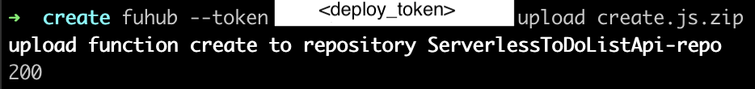
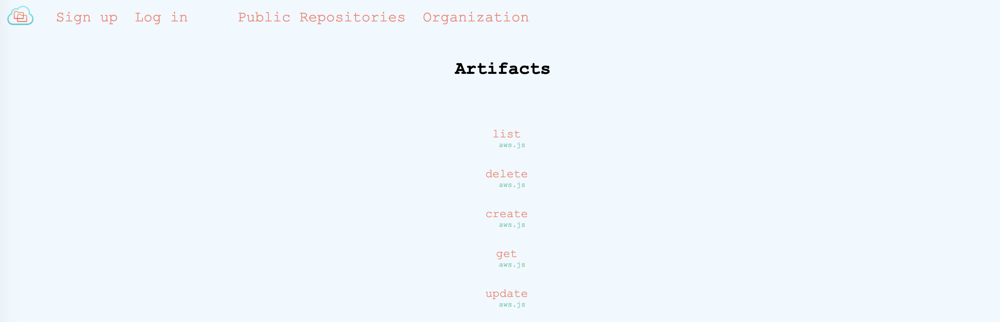
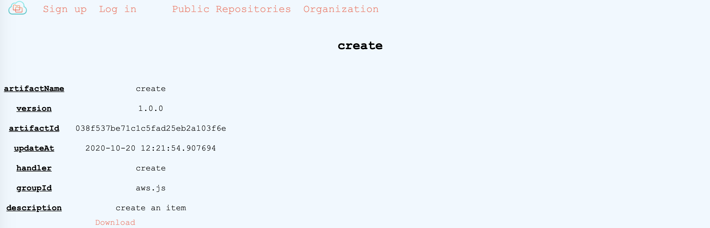

# Function hub
Taken from the [documentation](https://functionhub-cli.readthedocs.io/en/latest/):

> FunctionHub is the package manager for general, reusable Functions for cloud vendors like AWS, Google cloud and Azure. It is the main interaction point with Cloudstash, a broader cloud based storage unit for functions
> and artifacts.

  
All the functions handling the back-end of the "SeverlessToDoListAPI" application will be hosted on FunctionHub and so they can be conveniently accessed through the cloud.

FunctionHub will provide access to them by a URL that we can later attach as a reference to the lambda’s “artifacts” property in GMT.

  
##### _Note_
_If you wish to **skip this step** move to [GMT](gmt.md). A public FunctionHub repository is already available with all the necessary functions. The repository can be found in Cloudstash.io under the name “ServerlessToDoListApi-repo”)._

## Functions preparation
Fetch the source code of the lambda functions. Visit the [GitHub repository](https://github.com/iaas-splab/todo-api-nodejs) and download the files.

5 lambda functions are needed for the "ServerlessToDoListAPI" applciation:
- create
- delete
- get
- list
- update
  
### Tasks
- Create a user in [Cloudstash.io](https://cloudstash.io/) and log in (Make sure to store the provided **deploy_token**).
- Create a new public/private repository in [Cloudstash.io](https://cloudstash.io/).
- Install [FunctionHub-cli](https://pypi.org/project/functionhub/) using your terminal.
-   Create a project for each function `fuhub  create  <project_name>` and populate all the config.ini files with the right properties:

 <details>
      <summary>Create</summary>

```

[REPOSITORY]
org = <your_cloudstash_user>
repository = <your_functions_repository>

[FUNCTION]
name = create
version = 1.0.0
description = create an item

[RUNTIME]
provider = aws
runtime = js
handler = create.handler
```

</details>
<details>
      <summary>Delete</summary>

```

[REPOSITORY]
org = <your_cloudstash_user>
repository = <your_functions_repository>

[FUNCTION]
name = delete
version = 1.0.0
description = delete an item

[RUNTIME]
provider = aws
runtime = js
handler = delete.handler
```

</details>
<details>
      <summary>Get</summary>

```

[REPOSITORY]
org = <your_cloudstash_user>
repository = <your_functions_repository>

[FUNCTION]
name = get
version = 1.0.0
description = get items

[RUNTIME]
provider = aws
runtime = js
handler = get.handler
```

</details>
<details>
      <summary>List</summary>

```

[REPOSITORY]
org = <your_cloudstash_user>
repository = <your_functions_repository>

[FUNCTION]
name = list
version = 1.0.0
description = list items

[RUNTIME]
provider = aws
runtime = js
handler = list.handler
```

</details>
<details>
      <summary>Update</summary>

```

[REPOSITORY]
org = <your_cloudstash_user>
repository = <your_functions_repository>

[FUNCTION]
name = update
version = 1.0.0
description = update an item

[RUNTIME]
provider = aws
runtime = js
handler = update.handler
```

</details>


-  ZIP the source code and store it in the same direcotry as the config.ini file.
-  Upload the functions executing : `fuhub --token <deploy_token> upload <zipped_function>`



## Outcome

After uploading all the functions with FunctionHub-cli, the listing of functions  will be as following:



The function details of the "create" function can be seen in the following image where the user can either retrieve artifact details such as "artifactId" and "handler" or simply download the function locally.



## Next step

Head over to [GMT](gmt.md) section to model your appliation.

