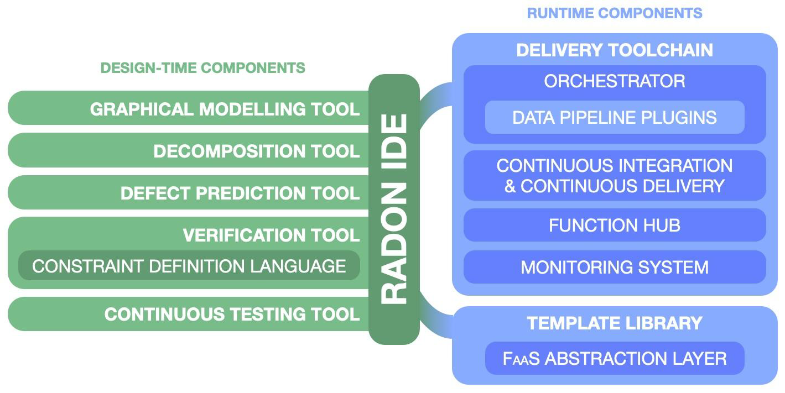
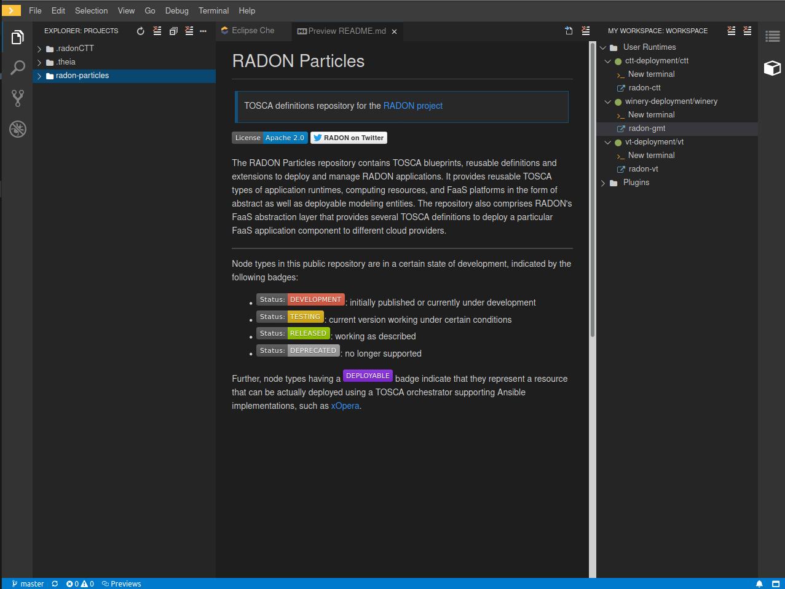
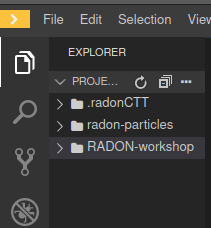

# IDE and Graphical modeling tool

The RADON development environment is based on the
[Eclipse Che](https://www.eclipse.org/che/)
technology: an open source developer workspace
server which comes with a cloud integrated
development environment (IDE) used by developers
to create applications without the need to install
any software on their local system.

> A more comprehensive documentation on the RADON
> IDE can be found in the IDE
> [ReadTheDocs webpage](https://radon-ide.readthedocs.io/en/latest/).

## The IDE

The RADON IDE will have all the tools needed to
develop, model, orchestrate and deploy serverless
functions, through its various components shown in
the picture below:

In this workshop, we will try out a subsection of
all the different tools available.

Everything in the IDE is a container in itself,
making it easy to support the programming language
of your choice.

### Tasks

- Login to the environment through the
  [Website](http://che-che.51.11.43.6.nip.io/)
- In the dashboard select `Get Started` tab and
  then `Custom Workspace`.
- Copy the URL of the
  [RADON Devfile available here](https://raw.githubusercontent.com/radon-h2020/radon-ide/master/devfiles/radon/v0.0.4/devfile.yaml)
  and paste it in the field URL of devfile under
  Devfile section.
- Set the Storage Type to `ephemeral`
- Then click on `Load devfile`
- once the RADON devfile has been loaded click on
  the `Create & Open button`

After the workspace have been created you will be
greeted with the following screen (here in dark
mode):

Now you are ready to clone down the project code. (Skip this step if you are using the pre-packaged source code from Function Hub)

- Click terminal and
  `Open terminal in specific container` use the
  theia tooling container and clone down this
  repository with the command
  `git clone https://github.com/radon-h2020/RADON-workshop.git`
- The project will be cloned in to a folder beside
  the RADON folder, ready for developing.

> Note: in the workshop, we will not be changing
> the content of the repository, but only try to
> model and deploy due to time constraint.

For the ease of the workshop, we have pre-packaged
the functions needed in the next part. If you want
to package and upload the functions yourself, you
can use [The functionhub provided](functionhub.md)
with the framework as well.

## Next step

Head over to [Function Hub](functionhub.md) section to prepare the source code packages for the application.