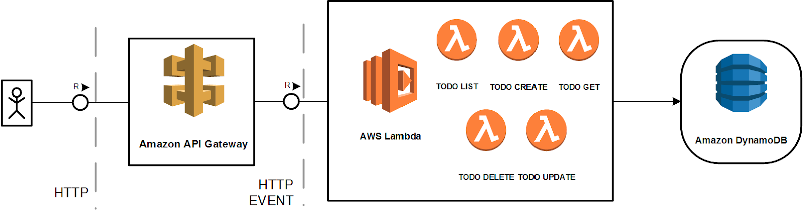

# Introduction to the application and RADON

This is a lab which provides an introduction to
the RADON framework, and the example application
we are working with.

By completing all the labs in this repository, you
will be able to understand and use parts of the
RADON framework to deploy any serverless
application to the cloud.

## Application introduction

The application which we will deploy is taken from
[Kraig Hufstedler's todo-list application](https://github.com/kraigh/serverless-todo-api).

The application aids in showcasing the creation
and deployment of a serverless application.

From a functionality point of view, it realizes a
serverless API application, exposing several
functions through an API Gateway that modify a
database on the cloud.

To break it down we have the following serverless
components:

- 5 lambda functions
  (create/delete/get/list/update)
- 1 dynamoDB for storage
- 1 API gateway to call the different functions

## RADON introduction

XXX Radon is many things, focus first is the tools
that help you develop, and deploy to cloud.

The

The RADON IDE (Integrated Development Environment)
provides a web-based development environment that
supports multi-user usage and acts as the host
environment for the RADON framework by enabling
the interaction with the RADON tools.
