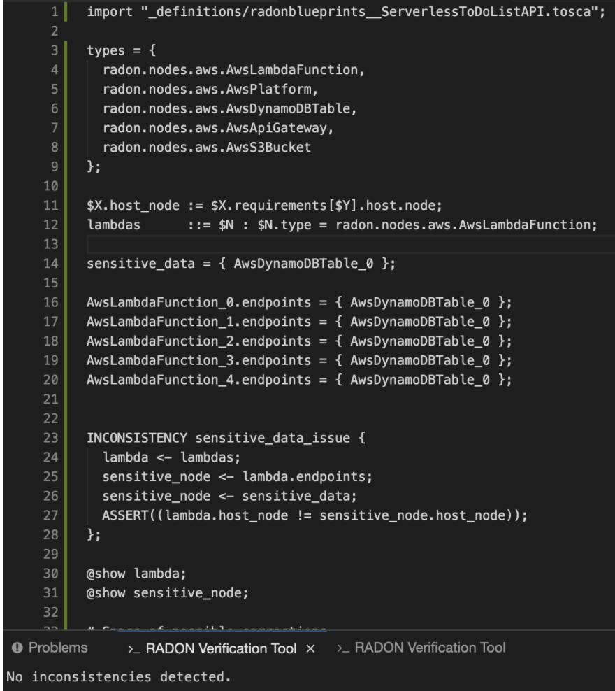
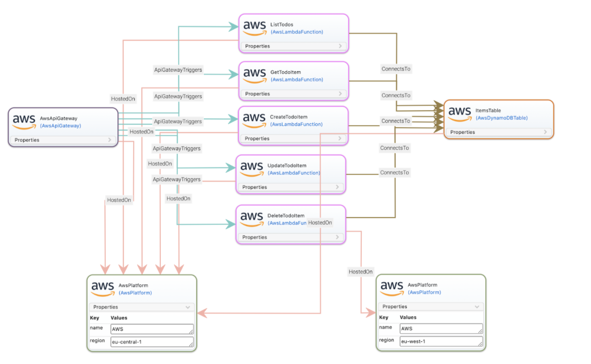
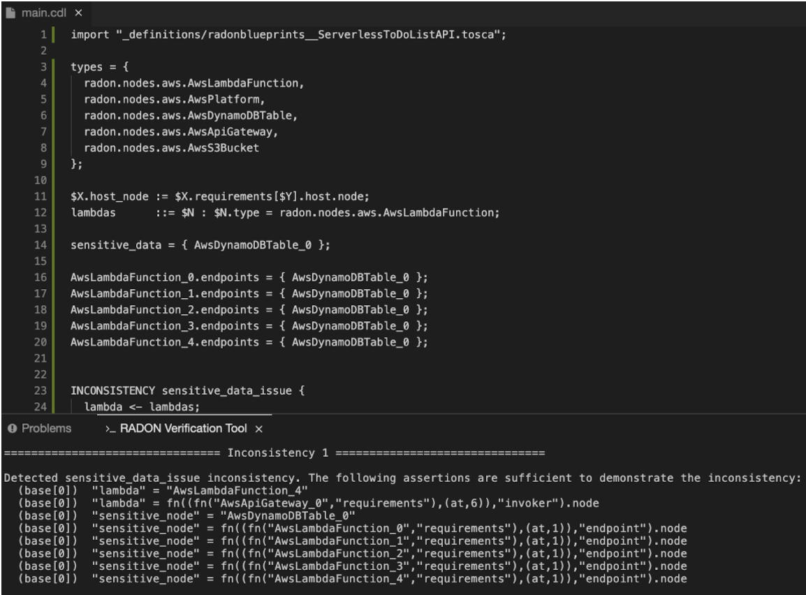

# Verification Tool

The primary purpose of the verification tool is to allow a user to
verify that a given FaaS architecture complies with a set of functional
and non-functional requirements. These requirements are encoded using a
new language, based on logic, called the constraint definition language
(CDL).

The tool takes as input a FaaS architecture and a CDL specification, and
outputs a list of issues with the FaaS architecture (i.e. a list of
violations of the CDL specification). The user can then use this
information to correct their FaaS architecture. As correction of a FaaS
architecture, and specification of requirements can be a hard task for
non-expert users, the tool also provides two additional modes in order
to help a user correct a non-compliant architecture, and to aid the user
to specify requirements in the CDL.

A more detailed technical overview can be found in the [VT
documentation](https://radon-vt-documentation.readthedocs.io/en/latest/).

For the purposes of this tutorial, a simple set of constraints have been
created in the CDL file [main.cdl](TODO). The constraints state that if
a lambda function accesses sensitive data (where the nodes which contain
sensitive data are given in the CDL specification), then it should be
hosted on the same AwsPlatform as the data. In this simple case, the
constraints mean that the resource components in the model have to be
hosted on the same AwsPlatform. `ServerlessToDoListAPI` has been
implemented as such, so when we invoke the verification test importing
the service template of the created application, no consistencies are
found as expected. After importing this file into the IDE workspace, the
VT can be invoked choosing the option "Verify" by right clicking on the
CDL file. The image below shows the structure of the CDL file along with
the output of the verification test on the bottom.

In order to put the VT to the test, we will slightly modify the topology
model of the `ServerlessToDoListAPI` hosting 1 of the 5 lambda functions
(`DeleteToDoItem`) to a different region than the rest of the components,
resulting in the topology below.

As we can see, the modified topology does not comply with the CDL
specification (`AwsLambdaFunction_4` is stored on a different platform
to `AwsDynamoDBTable_0`, and because the table contains sensitive data
and is accessed by the lambda, this is a violation of the constraints).
If we invoke the VT again (again by right-clicking on `main.cdl` and
selecting the "Verify" option), we will see the following output from
the VT.

This prompts the modeler to make modifications accordingly to resolve
the inconsistency between the CDL specification and the model.

