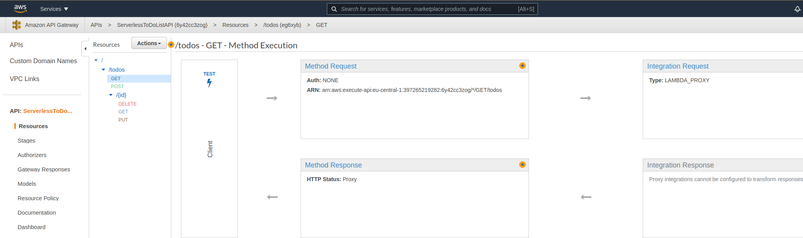
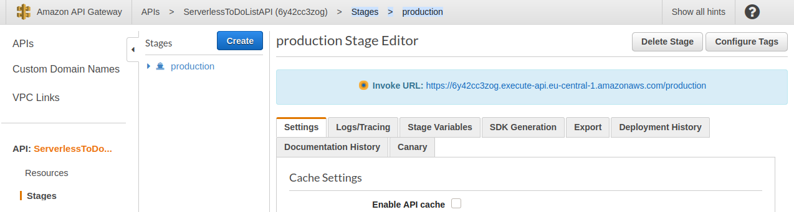

# Deploy your functions

We have now successfully made a deployable model,
only thing we need now is to deploy it.

RADON comes with its own deployment tool called
xOpera.

The first thing needed is to export the model from
GMT into the IDE.

### Tasks

- open GMT (link in the right side of the IDE)
- Locate your model in the service templates,
  click on the template.
- Click `export` and `export to ide`
- Go back to the IDE and check that a new root
  folder called `radon-csars` has been created.
- Open the folder and check that you have a file
  called the same as your service template and
  with the `.csars` extension.

You are now ready to either use the
[CLI version](#cli-version) of the deployment
tool, or the [SaaS offering](#saas-version).

## CLI version

[xOpera](https://github.com/xlab-si/xopera-opera)
aims to be a lightweight orchestrator compliant
with OASIS TOSCA model used in RADON.

The orchestrator puts the application into the
runtime environment, enforcing the state described
by application blueprint (CSAR file downloaded)
onto AWS. The common operations are deployment and
un-deploy and are executed on different target
environments such as staging, development and
production.

The CLI can be

### Tasks

> Note: In order for this to work, you need to
> have set your AWS credentials as environment
> variables. For more info look at the
> [env variables](https://docs.aws.amazon.com/cli/latest/userguide/cli-configure-envvars.html)
> needed, and
> [how to create IAM credentials](https://docs.aws.amazon.com/IAM/latest/UserGuide/getting-started_create-admin-group.html)

- Download the `.csar` file from IDE, by clicking
  on the file in the IDE, and choose `download`
- install opera through pip, or use the docker
  image in this repository.

<details>
      <summary>pip</summary>

Look at the installation guide on the
[GH webpage](https://github.com/xlab-si/xopera-opera#prerequisites)

```bash
mkdir ~/opera && cd ~/opera
python3 -m venv .venv && . .venv/bin/activate
pip install opera boto3
```

Run the following command in the folder where you
have the `csar` file stored (here called
`todo.csar`)

```bash
opera deploy -c todo.csar
```

After executing the opera, you should see
something like this printed out.

```bash
[Worker_0]   Deploying AwsPlatform_0_0
[Worker_0]     Executing configure on AwsPlatform_0_0
[Worker_0]   Deployment of AwsPlatform_0_0 complete
[Worker_0]   Deploying AwsDynamoDBTable_0_0
[Worker_0]     Executing create on AwsDynamoDBTable_0_0
[Worker_0]   Deployment of AwsDynamoDBTable_0_0 complete
[Worker_0]   Deploying AwsLambdaFunction_1_0
[Worker_0]     Executing create on AwsLambdaFunction_1_0
[Worker_0]   Deployment of AwsLambdaFunction_1_0 complete
[Worker_0]   Deploying AwsLambdaFunction_2_0
[Worker_0]     Executing create on AwsLambdaFunction_2_0
[Worker_0]   Deployment of AwsLambdaFunction_2_0 complete
[Worker_0]   Deploying AwsLambdaFunction_0_0
[Worker_0]     Executing create on AwsLambdaFunction_0_0
[Worker_0]   Deployment of AwsLambdaFunction_0_0 complete
[Worker_0]   Deploying AwsLambdaFunction_3_0
[Worker_0]     Executing create on AwsLambdaFunction_3_0
[Worker_0]   Deployment of AwsLambdaFunction_3_0 complete
[Worker_0]   Deploying AwsLambdaFunction_4_0
[Worker_0]     Executing create on AwsLambdaFunction_4_0
[Worker_0]   Deployment of AwsLambdaFunction_4_0 complete
[Worker_0]   Deploying AwsApiGateway_0_0
[Worker_0]     Executing create on AwsApiGateway_0_0
[Worker_0]     Executing pre_configure_source on AwsApiGateway_0_0--AwsLambdaFunction_0_0
[Worker_0]     Executing pre_configure_source on AwsApiGateway_0_0--AwsLambdaFunction_1_0
[Worker_0]     Executing pre_configure_source on AwsApiGateway_0_0--AwsLambdaFunction_2_0
[Worker_0]     Executing pre_configure_source on AwsApiGateway_0_0--AwsLambdaFunction_3_0
[Worker_0]     Executing pre_configure_source on AwsApiGateway_0_0--AwsLambdaFunction_4_0
[Worker_0]     Executing configure on AwsApiGateway_0_0
[Worker_0]   Deployment of AwsApiGateway_0_0 complete

```

</details>

<details>
      <summary>docker</summary>

In the same folder where you have the `csar` file,
create a file called `env.list` with your AWS
credentials like this:

```env
AWS_ACCESS_KEY_ID=KEY_ID_HERE
AWS_SECRET_ACCESS_KEY=ACCESS_KEY_HERE
```

Run the following command in the folder where you
have the `csar` file stored (here called
`todo.csar`)

```bash
docker run -it -v $PWD:/tmp/opera --env-file env.list praqma/operacli opera deploy -c todo.csar
```

```bash
[Worker_0]   Deploying AwsPlatform_0_0
[Worker_0]     Executing configure on AwsPlatform_0_0
[Worker_0]   Deployment of AwsPlatform_0_0 complete
[Worker_0]   Deploying AwsDynamoDBTable_0_0
[Worker_0]     Executing create on AwsDynamoDBTable_0_0
[Worker_0]   Deployment of AwsDynamoDBTable_0_0 complete
[Worker_0]   Deploying AwsLambdaFunction_1_0
[Worker_0]     Executing create on AwsLambdaFunction_1_0
[Worker_0]   Deployment of AwsLambdaFunction_1_0 complete
[Worker_0]   Deploying AwsLambdaFunction_2_0
[Worker_0]     Executing create on AwsLambdaFunction_2_0
[Worker_0]   Deployment of AwsLambdaFunction_2_0 complete
[Worker_0]   Deploying AwsLambdaFunction_0_0
[Worker_0]     Executing create on AwsLambdaFunction_0_0
[Worker_0]   Deployment of AwsLambdaFunction_0_0 complete
[Worker_0]   Deploying AwsLambdaFunction_3_0
[Worker_0]     Executing create on AwsLambdaFunction_3_0
[Worker_0]   Deployment of AwsLambdaFunction_3_0 complete
[Worker_0]   Deploying AwsLambdaFunction_4_0
[Worker_0]     Executing create on AwsLambdaFunction_4_0
[Worker_0]   Deployment of AwsLambdaFunction_4_0 complete
[Worker_0]   Deploying AwsApiGateway_0_0
[Worker_0]     Executing create on AwsApiGateway_0_0
[Worker_0]     Executing pre_configure_source on AwsApiGateway_0_0--AwsLambdaFunction_0_0
[Worker_0]     Executing pre_configure_source on AwsApiGateway_0_0--AwsLambdaFunction_1_0
[Worker_0]     Executing pre_configure_source on AwsApiGateway_0_0--AwsLambdaFunction_2_0
[Worker_0]     Executing pre_configure_source on AwsApiGateway_0_0--AwsLambdaFunction_3_0
[Worker_0]     Executing pre_configure_source on AwsApiGateway_0_0--AwsLambdaFunction_4_0
[Worker_0]     Executing configure on AwsApiGateway_0_0
[Worker_0]   Deployment of AwsApiGateway_0_0 complete
```

</details>

After successfully deployed the model, head on to
[test the deployment](#Test-out-the-serverless-application)
in the section below.

## SaaS version

> NOTE: this is under heavy development, so the
> guide might not work with the latest version.

Opera SaaS steps:

- Access the UI :
  https://xopera-radon.xlab.si/ui/. You can login
  using your radon credentials
- Create a workspace
- Create credentials
  - Name: whatever you want
  - For AWS use the same path that is used on
    local: /root/.aws/credentials
  - Copy the content of the credentials file found
    on your local machine on
    /root/.aws/credentials. Example below...

```
[default]
aws_access_key_id = <secret>
aws_secret_access_key = <secret>
```

- Assign credentials to the workspace
- Invoke opera SaaS deploy from IDE
- Choose in which workspace to deploy it
- Create a project providing a name
- Choose whether you want to deploy to Cloud
  provider or not
- Provide the Service template name ( you need to
  download the csar and unzip it. The service
  template name you need to provide looks like
  this:
  “\_definitions/steIgeneral\_\_myexampleproject.tosca”
- Provide the inputs file.
  - It can be an empty inputs.yaml (containing
    :{}) and it can be stored in the IDE
    workspace. You access it in the projects
    folder on the popup
- Check deployment status in the UI.
- After successful deployment send a POST request
  to the apilink/todos with the following payload
  to tests the functionality of the application: {
  "todo": "Have a another coffee :-)" }

## Test out the serverless application

Now comes the time to test out the serverless
application.

You can either do it with the AWS UI, or with
postman(or curl if you dare).

Click on the tool of choice below.

### Tasks

<details>
      <summary>AWS UI</summary>

- Log into AWS account
- Go into `Amazon API Gateway` and select
  `ServerlessToDoListAPI`
- 
- Click on the /todos `GET` method, and `test` and
  see that the result you get back in the response
  body is an empty list; `[]`
- To populate with a todo, Click on the /todos
  `POST` method, and `test`
- In the resquest body, paste in the payload:
  `{"todo":"buy milk"}` and click `test`
- Get back to test the /todos `GET` method to see
  that the item has been persisted.

</details>
<details>
      <summary>Postman</summary>

- Log into AWS account
- Go into `Amazon API Gateway` and select
  `ServerlessToDoListAPI`
- To get the URL to test, click on `Stages`
  `production` and take the `invoke URL:`
- 
- Open Postman
- Send a `get` message to `<invokeURL>/todos` and
  see that the result you get back in the response
  body is an empty list; `[]`
- To populate with a todo, send a `POST` method to
  `<invokeURL>/posts` with a resquest body like
  `{"todo":"buy milk"}`
- Get back to test the /todos `GET` method to see
  that the item has been persisted.

</details>

## Clean up

When you are finished playing around, you can use
opera to undeploy. To undeploy use
`opera undeploy` and watch the logs to make sure
that all gets deleted.
